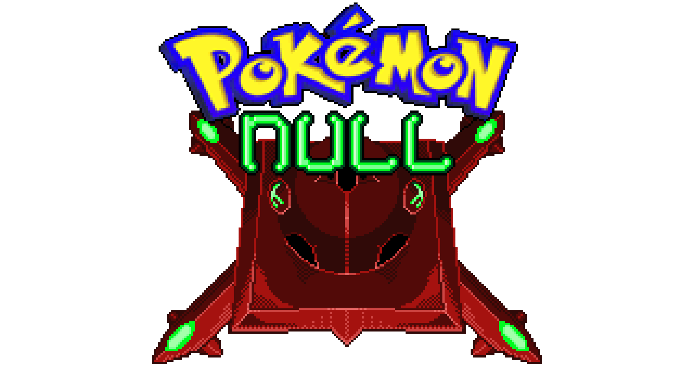

# Pokémon Null AI documentation

This document explains how the AI behaves during a turn. It is not fully exhaustive, and while I have done my best to ensure accuracy, mistakes, omissions, or outdated information may still be present. Most relevant cases are covered, but some moves and score values may be missing. If you notice something important that is incorrect, missing, or unclear, please contact Terra on Discord so it can be reviewed and updated.

-   __Move Scoring__ :octicons-arrow-right-24: [View Move Scores](move-scoring.md)

    ---

    Quick reference for how the AI evaluates damaging moves, priorities, setup categories, and status move modifiers.

-   __Switch AI__ :octicons-arrow-right-24: [View Switch Logic](switch-ai.md)

    ---

    Breakdown of post-KO switch scores, mid-turn conditions, and anti-setup triggers.

-   __Support Pokémon__ :octicons-arrow-right-24: [View Support Definitions](support-pokemon.md)

    ---

    Criteria for how the AI classifies support utility mons and handles restricted move counts.

-   __Frequently Asked Questions__ :octicons-arrow-right-24: [View Q&A](faq.md)

    ---

    Clarifications on multi-hit checks, speed tier evaluations, and hidden mechanical quirks.

